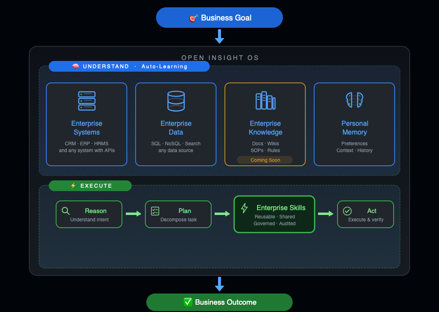

# Open Insight

### Build an AI workforce for your enterprise.

> **A team of AI employees designed to understand your business, perform specialized work, and deliver real business outcomes.**

It enables AI to understand enterprise systems, enterprise data, enterprise knowledge and personal memory, then execute real business tasks through reusable **Enterprise Skills**.

  <a href="https://github.com/OpenInsightHQ/openinsight"><strong>Get Started →</strong></a>
  &nbsp;&nbsp;·&nbsp;&nbsp;
  <a href="https://github.com/OpenInsightHQ/openinsight#quick-start"><strong>Quick Deployment</strong></a>

<strong>Deploy Open Insight on your own server and start experiencing enterprise AI in minutes.</strong>

---

## Architecture

> **Enterprise AI starts with understanding the enterprise.**

  

### ONE-PI Agent Architecture

ONE-PI connects to an extensible set of expert agents, each equipped with Prompt, MCP, API, and Skill capabilities.

  

---

## Why Open Insight?

Most Data Agent systems are designed to answer questions.

**Open Insight is designed to achieve business goals.**

Enterprises don't measure conversations.

**They measure outcomes.**

## Built for Enterprise, Not Personal AI

Most AI Agents are designed for individual users.

Each user installs, configures and manages their own AI environment.

Open Insight takes a different approach.

The enterprise learns once. Everyone benefits.

Open Insight continuously learns from the enterprise — its data, systems, business knowledge, workflows, skills, and expertise. This knowledge is centrally managed, governed, and made available to employees across the organization.

Employees don't need to build their own AI from scratch. They simply use AI to accomplish their work to achieving business goals.

As employees use Open Insight, their interactions, feedback, and outcomes can further improve the AI.

It runs on enterprise infrastructure, not personal laptops. No installation, no setup, no maintenance burden on employees. It works **24/7** — monitoring systems, processing tasks, and collaborating with other AI agents across departments.

---

## Get Started

Deploy Open Insight on your own infrastructure and experience the Enterprise Agent Operating System.

**[Download and deploy Open Insight →](https://github.com/OpenInsightHQ/openinsight)**
